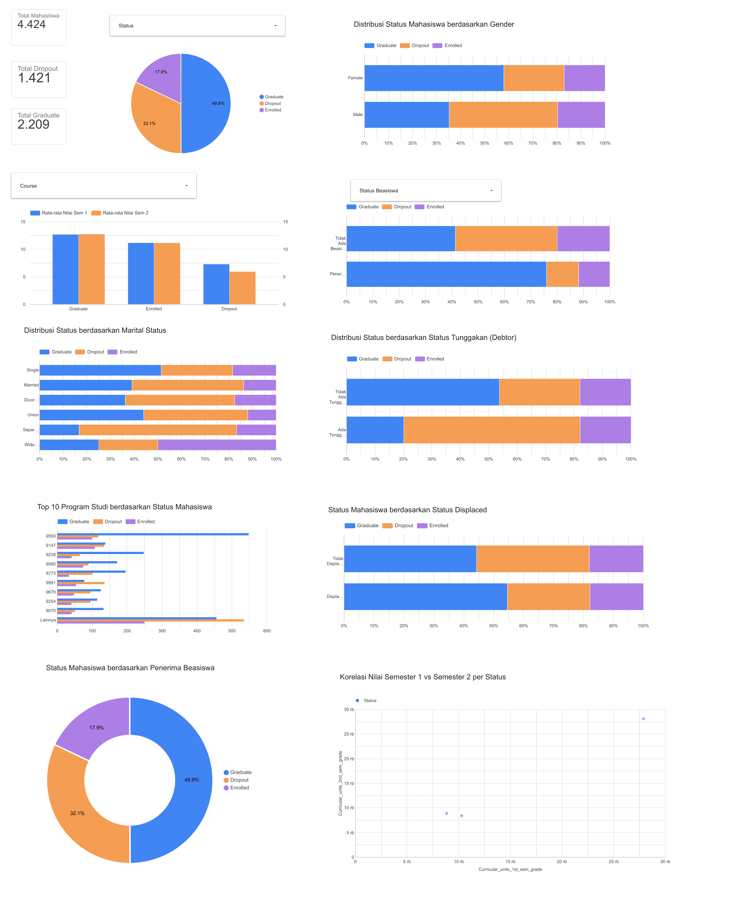

# Proyek Akhir: Menyelesaikan Permasalahan Institusi Pendidikan

## Business Understanding

**Jaya Jaya Institut** adalah institusi pendidikan tinggi yang telah berdiri sejak tahun 2000 dan telah mencetak ribuan lulusan berkualitas. Namun, dalam beberapa tahun terakhir, institusi menghadapi permasalahan serius berupa **tingginya angka *dropout* mahasiswa** yang berdampak langsung pada:

- **Reputasi institusi**: Tingkat kelulusan yang rendah menurunkan peringkat dan daya tarik calon mahasiswa baru.
- **Kerugian finansial**: Mahasiswa yang *dropout* berarti kehilangan pendapatan biaya kuliah jangka panjang.
- **Dampak sosial**: Mahasiswa yang tidak menyelesaikan studi kehilangan kesempatan meningkatkan kualitas hidup.

**Tujuan bisnis** dari proyek ini adalah membantu pihak manajemen Jaya Jaya Institut — khususnya **Bagian Akademik, Konselor Mahasiswa, dan Pimpinan Institusi** — untuk:
1. Memahami faktor-faktor utama yang mendorong mahasiswa *dropout*.
2. Mengidentifikasi mahasiswa berisiko *dropout* **sedini mungkin**, sehingga intervensi tepat waktu dapat dilakukan.
3. Mengambil keputusan berbasis data (*data-driven decision making*) dalam merancang program retensi mahasiswa.

Dampak yang diharapkan: penurunan angka *dropout* secara signifikan melalui intervensi proaktif, peningkatan tingkat kelulusan, serta penguatan reputasi institusi secara keseluruhan.

### Permasalahan Bisnis

Jaya Jaya Institut menghadapi permasalahan spesifik berikut:

1. **Tidak ada sistem deteksi dini**: Selama ini, identifikasi mahasiswa berisiko *dropout* baru dilakukan setelah mereka benar-benar berhenti kuliah — terlambat untuk dilakukan intervensi.
2. **Volume data yang besar**: Dengan ribuan mahasiswa aktif, sulit bagi konselor untuk memantau setiap mahasiswa secara manual.
3. **Ketidakpastian faktor risiko**: Pihak manajemen belum memiliki pemahaman kuantitatif tentang variabel mana (nilai akademik, kondisi finansial, demografi) yang paling berpengaruh terhadap *dropout*.

**Pihak yang terdampak**: Mahasiswa berisiko (yang kehilangan akses pendidikan), staf akademik (beban kerja meningkat tanpa panduan prioritas), dan manajemen institusi (penurunan performa institusi).

**Intervensi yang dapat dilakukan** berdasarkan hasil identifikasi:
- Konseling akademik intensif bagi mahasiswa dengan nilai semester 1 yang sangat rendah.
- Program bantuan finansial atau skema cicilan bagi mahasiswa dengan tunggakan biaya kuliah.
- Pemantauan khusus bagi mahasiswa di program studi dengan angka *dropout* tertinggi.

### Cakupan Proyek

Proyek ini mencakup:
1. **Analisis Eksploratif Data (EDA)**: Univariate, multivariat, numerikal, dan kategorikal untuk menggali pola dan hubungan antar variabel.
2. **Pembuatan Business Dashboard**: Memvisualisasikan distribusi status mahasiswa dan faktor-faktor risikonya untuk dipantau oleh manajemen.
3. **Membangun Model Machine Learning**: Model klasifikasi biner (Dropout vs. Graduate) menggunakan Random Forest Classifier.
4. **Deploy Prototype**: Aplikasi web berbasis Streamlit sebagai *Early Warning System* yang dapat digunakan oleh konselor untuk memprediksi risiko *dropout* mahasiswa aktif.

### Persiapan

Sumber data: [students_performance.csv](https://github.com/dicodingacademy/dicoding_dataset/tree/main/students_performance)

Setup environment:
- **Versi Python**: `Python 3.13.1`

```bash
python -m venv venv
venv\Scripts\activate
pip install -r requirements.txt
```

## Business Dashboard

Visualisasi performa akademik dan faktor risiko mahasiswa disajikan dalam Business Dashboard interaktif menggunakan Looker Studio yang komprehensif. Dashboard ini dirancang untuk memberikan wawasan mendalam bagi pihak manajemen institusi melalui berbagai visualisasi:

1. **Scorecards Metrik Utama**:
   - Total Mahasiswa: **4.424**
   - Total Mahasiswa Dropout: **1.421** (32.1%)
   - Total Mahasiswa Graduate: **2.209** (49.9%)

2. **Filter Interaktif**:
   - Filter Status Mahasiswa (Dropout, Graduate, Enrolled)
   - Filter Program Studi (*Course*)
   - Filter Status Penerima Beasiswa (*Scholarship Holder*)

3. **Visualisasi Faktor Risiko & Demografi**:
   - **Proporsi Status Mahasiswa**: Pie chart distribusi mahasiswa (Graduate: 49.9%, Dropout: 32.1%, Enrolled: 17.9%).
   - **Performa Akademik**: Bar chart rata-rata nilai Semester 1 dan Semester 2 berdasarkan status mahasiswa (mahasiswa dropout memiliki rata-rata nilai yang jauh lebih rendah).
   - **Keterkaitan Status dengan Gender**: Visualisasi perbandingan status mahasiswa pria vs. wanita (tingkat dropout pada mahasiswa pria lebih tinggi).
   - **Keterkaitan Status dengan Beasiswa**: Donut & bar chart menunjukkan penerima beasiswa memiliki rasio kelulusan yang jauh lebih tinggi.
   - **Keterkaitan Status dengan Marital Status**: Menunjukkan pola dropout pada berbagai status pernikahan (Single, Married, Divorced, Union, Separated, Widower).
   - **Keterkaitan Status dengan Tunggakan (Debtor)**: Mahasiswa yang memiliki tunggakan biaya kuliah memiliki proporsi dropout yang signifikan lebih besar.
   - **Top 10 Program Studi (*Course*)**: Distribusi status mahasiswa pada 10 program studi terpopuler untuk memantau jurusan dengan risiko dropout tertinggi.
   - **Keterkaitan Status dengan Status Displaced**: Analisis mahasiswa yang pindah tempat tinggal (*displaced*) terhadap tingkat kelulusan.
   - **Korelasi Nilai Semester 1 vs. Semester 2**: Scatter plot korelasi nilai antarsemsester per status mahasiswa.

**Tautan Dashboard**: [Dashboard Pemantauan Mahasiswa - Jaya Jaya Institut](https://datastudio.google.com/reporting/8c134ae4-5ed8-4487-b928-411857cdcec6)

Berikut adalah tangkapan layar dari dashboard yang telah dibuat:



## Menjalankan Sistem Machine Learning

Prototype sistem *Early Warning System* dibangun menggunakan Streamlit. Model memprediksi apakah seorang mahasiswa berpotensi **Dropout** atau **Graduate** berdasarkan data akademik dan demografis.

Untuk menjalankan secara lokal:

```bash
streamlit run app.py
```

Aplikasi akan terbuka di browser (biasanya `http://localhost:8501`). Masukkan data profil mahasiswa dan klik **Prediksi** untuk melihat hasil.

**Tautan Streamlit Community Cloud**: [https://dashboard-proyek-akhir-jaya-jaya-isntitut-dcd.streamlit.app/](https://dashboard-proyek-akhir-jaya-jaya-isntitut-dcd.streamlit.app/)

## Conclusion

Dari hasil Exploratory Data Analysis (EDA) dan pemodelan Machine Learning yang telah dilakukan pada dataset 3.630 mahasiswa (Dropout & Graduate), diperoleh temuan utama berikut:

- **Performa Akademik (Nilai Semester 1 & 2)** adalah prediktor **terkuat** terhadap risiko *dropout*. Mahasiswa dengan nilai sangat rendah atau unit disetujui = 0 di semester 1 memiliki probabilitas *dropout* yang sangat tinggi.
- **Unit Kurikulum Disetujui** (*Curricular Units Approved*): Mahasiswa yang tidak lulus satupun mata kuliah di semester pertama hampir seluruhnya *dropout*.
- **Tunggakan Biaya Kuliah & Utang** (*Tuition Fees & Debtor*): Mahasiswa yang menunggak biaya kuliah atau tercatat sebagai *debtor* memiliki proporsi *dropout* yang jauh lebih tinggi.
- **Beasiswa** (*Scholarship Holder*): Penerima beasiswa memiliki tingkat kelulusan signifikan lebih tinggi (~75% graduate).
- **Gender**: Mahasiswa pria memiliki tingkat *dropout* lebih tinggi dibandingkan mahasiswa wanita.
- **Status Pernikahan** (*Marital Status*): Mahasiswa yang berstatus menikah, bercerai, atau terpisah memiliki rasio *dropout* yang lebih tinggi dibanding mahasiswa lajang (*single*).
- **Program Studi** (*Course*): Terdapat disparitas angka kelulusan antar jurusan, di mana beberapa program studi memiliki tingkat *dropout* di atas rata-rata sehingga memerlukan peninjauan kurikulum khusus.
- **Status Pindah Tempat Tinggal** (*Displaced*): Mahasiswa non-displaced dan displaced memiliki pola adaptasi yang berbeda yang mempengaruhi kelangsungan studi.

**Performa Model (Random Forest — Binary Classification):**
- Model dilatih hanya pada data mahasiswa berstatus Dropout dan Graduate (**3.630 sampel**).
- **Akurasi pada test set: 92.29%**
- **ROC-AUC: 0.9706**
- Precision Dropout: 0.92 | Recall Dropout: 0.88 | F1-Score: 0.90
- Data mahasiswa Enrolled (**794 mahasiswa**) disimpan terpisah di `data/enrolled_for_prediction.csv` dan siap digunakan sebagai input prediksi sistem.

### Rekomendasi Action Items

Berikut rekomendasi *action items* yang harus dilakukan institusi guna menyelesaikan permasalahan *dropout* mahasiswa:

1. **Sistem Peringatan Dini (Early Warning System)**: Gunakan aplikasi Streamlit ini saat nilai ujian tengah semester 1 keluar. Jika prediksi menunjukkan risiko *dropout* tinggi, lakukan konseling akademik intensif segera.

2. **Program Bantuan Finansial**: Karena tunggakan biaya kuliah sangat berkorelasi dengan *dropout*, pertimbangkan skema cicilan fleksibel atau dana darurat bagi mahasiswa yang kesulitan finansial.

3. **Peningkatan Program Beasiswa**: Penambahan kuota beasiswa terbukti efektif menekan angka *dropout*. Prioritaskan mahasiswa dengan potensi akademik tinggi namun kondisi ekonomi lemah.

4. **Monitoring per Program Studi**: Identifikasi program studi dengan angka *dropout* tertinggi dan lakukan evaluasi kurikulum serta kualitas pengajaran di program tersebut.

5. **Intervensi Awal Semester 1**: Fokuskan perhatian pada mahasiswa baru dengan nilai masuk (*admission grade*) rendah dan usia pendaftaran lebih tua, karena kelompok ini menunjukkan risiko *dropout* lebih tinggi.
